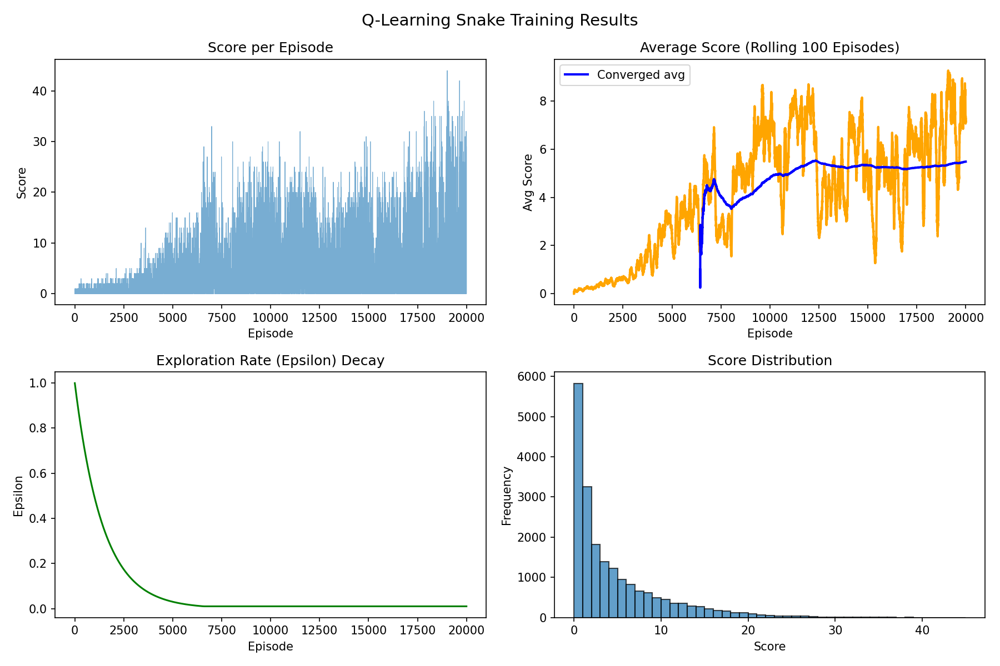

# 🐍 Reinforcement Learning Snake

A Q-learning agent that learns to play Snake from scratch using tabular reinforcement learning.


---

## 📊 Results

| Metric | Value |
|--------|-------|
| Average Score (converged) | ~6.5 |
| Best Score | 40+ |
| States Discovered | 64-128 |
| Training Episodes | 20,000 |



---

## 🧠 How It Works

### State Representation

The agent perceives the game through 8 boolean features:

| Feature | Description |
|---------|-------------|
| `danger_straight` | Collision risk if moving forward |
| `danger_right` | Collision risk if turning right |
| `danger_left` | Collision risk if turning left |
| `danger_straight_2` | Collision risk two steps ahead |
| `food_up` | Food is above the head |
| `food_down` | Food is below the head |
| `food_left` | Food is left of the head |
| `food_right` | Food is right of the head |
| `food_immediate` | Food is directly ahead (one step) |

This creates a state space of ~512 possible states — small enough for tabular Q-learning.

### Reward Structure

| Event | Reward |
|-------|--------|
| Eat food | +10 |
| Die (wall/self/timeout) | -10 |
| Move toward food | +1 |
| Move away from food | -1 |

### Q-Learning Update Rule
```
Q(s,a) ← Q(s,a) + α × [r + γ × max(Q(s',a')) - Q(s,a)]
```

Where:
- `α = 0.2` (learning rate, decays over time)
- `γ = 0.95` (discount factor)
- `ε = 1.0 → 0.01` (exploration rate, decays over training)

---

## 🚀 Quick Start

### Installation
```bash
# Clone the repository
git clone https://github.com/YOUR_USERNAME/YOUR_REPO.git
cd YOUR_REPO/reinforcement-learning-snake

# Create virtual environment
python -m venv .venv
.venv\Scripts\activate  # Windows
# source .venv/bin/activate  # Linux/Mac

# Install dependencies
pip install -r requirements.txt
```

### Train the Agent
```bash
python train.py
```

Training runs for 20,000 episodes (~2-6 minutes). Progress is printed every 100 episodes, and a plot is saved to `training_results.png`.

### Watch the Trained Agent Play
```bash
python play.py
```

---

## 📁 Project Structure
```
reinforcement-learning-snake/
├── snake_game.py      # Game environment with state representation
├── agent.py           # Q-learning agent (Q-table, ε-greedy, learning)
├── train.py           # Training loop with statistics and visualization
├── play.py            # Watch trained agent play
├── q_table.pkl        # Saved Q-table (generated after training)
├── requirements.txt
└── README.md
```

---

## 📈 Training Insights

### Death Cause Analysis

The agent's failure modes change over training:

| Phase | Primary Death Cause | Reason |
|-------|---------------------|--------|
| Early (random) | Wall collision | Random exploration |
| Mid (learning) | Timeout | Learns to survive but loops |
| Late (converged) | Self-collision | Actually playing, dies when long |

### Limitations of Tabular Q-Learning

The state representation abstracts away spatial information. The agent cannot:
- Plan paths around its own body
- Distinguish between different board configurations with same features
- Generalize to unseen states

This creates a performance ceiling around 6-8 average score. Higher performance would require:
- Deep Q-Networks (DQN) with raw pixel/grid input
- More sophisticated state features
- Monte Carlo Tree Search

---

## ⚙️ Hyperparameters

| Parameter | Value | Purpose |
|-----------|-------|---------|
| `learning_rate` | 0.2 → 0.01 | Q-value update magnitude |
| `discount_factor` | 0.95 | Future reward weighting |
| `epsilon` | 1.0 → 0.01 | Exploration vs exploitation |
| `epsilon_decay` | 0.9996 | Exploration schedule |
| `episodes` | 20,000 | Training length |
| `grid_size` | 15×15 | Game board dimensions |


