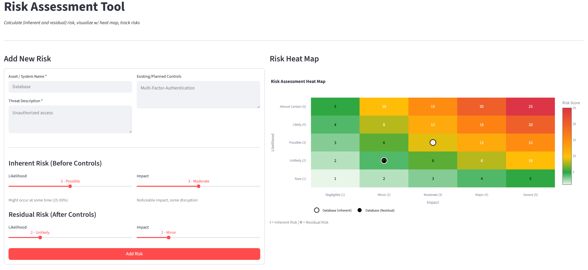

# 🎯 Risk Assessment Matrix Tool

A Streamlit-based IT risk assessment tool w/ Likelihood × Impact methodology and risk visualization.


---

## 📊 Overview

- Inherent and residual risk scoring
- 5×5 Likelihood × Impact risk matrix
- Interactive heat map visualization
- Risk register with CSV export

---

## 🖥️ Interface




---

## 🧮 Risk Model

Risk Score = Likelihood × Impact

| Score | Rating |
|------:|--------|
| 1–4 | Low |
| 5–9 | Medium |
| 10–16 | High |
| 17–25 | Critical |

---

## 🚀 Run Loccally
```
bash
pip install -r requirements.txt
streamlit run app.py
```
---

## 📁 Structure
```
risk-assessment-matrix/
├── app.py
├── risk_calculator.py
├── requirements.txt
└── README.md
└── risk-assessment-tool.png
```
---

## 🎯 Intended Use

- IT risk identification and scoring
- Control impact on residual risk
- Audit-style risk visualization and reporting

